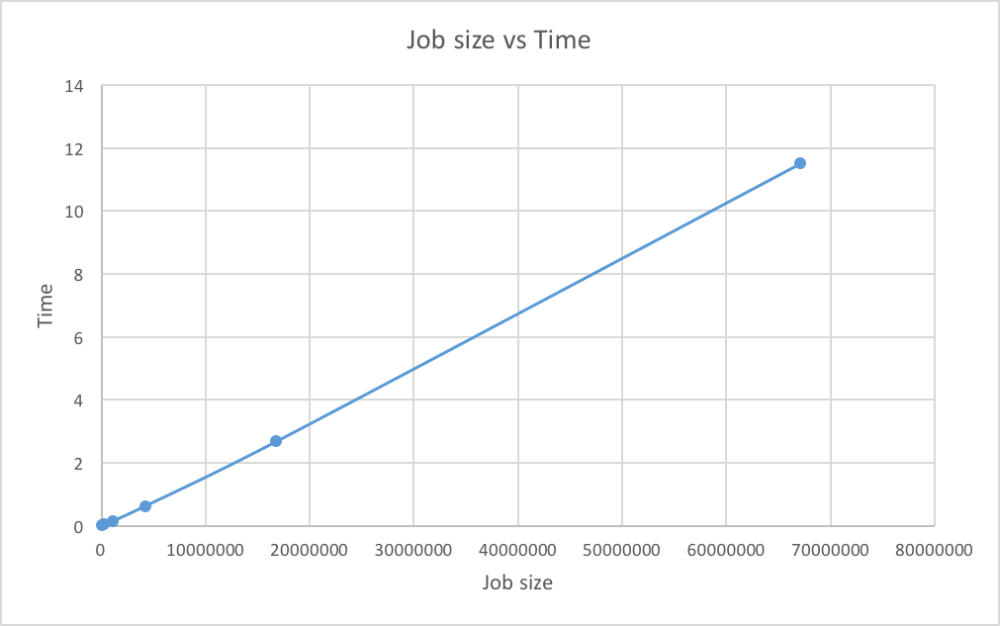
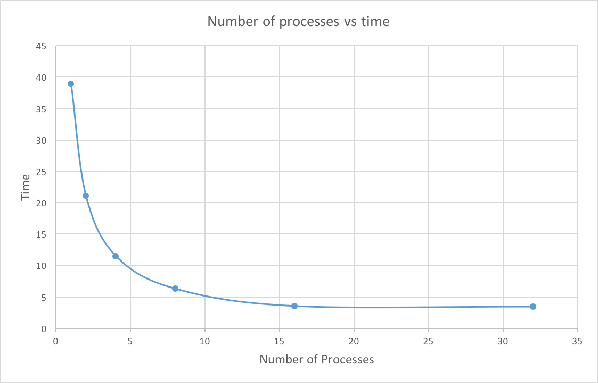

## Lab 3 - Parallel Hypersort using MPI

This assignment involves implementation of a parallel version of the well know Quicksort algorithm using MPI. Statement for the same is linked [here](./Statement.pdf).


#### Running the code

1. To compile -

    ```bash
    ./scripts/compile.sh
    ```

2. To run - 

    - To generate an input file, given n (for a population of 2^n) - 
        ```bash
        ./generate <n>
        ```
    
    - To perform hypersort -
        ```bash
        ./scripts/run.sh <input-file> <output-file> --numProcess  <number of processes>
        ```
    

#### Code Description


1. **Parallelisation  Strategy :**

    - Initially, the given file is just read by the process 0 and the relevant array fractions are then sent to different processes, after which each process has its own local vector. This distributes the given array equally (almost, when not a power of 2, last process gets the extra elements) amongst the various processes
    - In the middle of the algorithm, the size of vectors may change when half the arrays are received and sent to the other processes
    - This implementation might perform poorly in cases where after a split, few of the vectors might have large number of elements


2. **Design Decisions :** 

    - Vectors have been used instead of int[] as the size of the vector can be easily changed and helps easy merging of the two vectors at every iteration in every process
    - For convenience, we have only declared vectors once per process and clear it in every iteration so that system calls are minimised
    - As much as possibile, minimal copies of the data were created to improve memory performance
    - The extra copies have been cleared at every step
    - Different tags have been used to match matching calls, to avoid bugs in the code
    - The implementation is in C++11, a decent trade-off between code efficiency and coding efficiency


3. **Load Balancing Strategy :** 

    - We distribute the original array equally amongst the various threads. The last process may have slightly more data depending on divisibility of input size
    - Splitting the vector about the median of the process 0 subarray, after sorting, maximises the log likelihood that the split in the array will almost equal amongst all the processes
    - However, due to its probabilistic nature, the algorithm is likely to perform poorly in cases like after a split, few of the subarrays may have huge number of elements and some others may have less

4. **Results :**

    Job Size vs Time

    |  Job Size   |      Time     |
    | ----------- | ------------- |
    |    2^16     |    0.0082 s   |
    |    2^18     |     0.035 s   |
    |    2^20     |     0.145 s   |
    |    2^22     |      0.63 s   |
    |    2^24     |      2.68 s   |
    |    2^26     |     11.51 s   |

    

    Number of processes vs Time

    |  Processes  |      Time     |
    | ----------- | ------------- |
    |      1      |     38.94 s   |
    |      2      |     21.09 s   |
    |      4      |     11.51 s   |
    |      8      |      6.28 s   |
    |     16      |      3.52 s   |
    |     32      |      3.42 s   |

    
