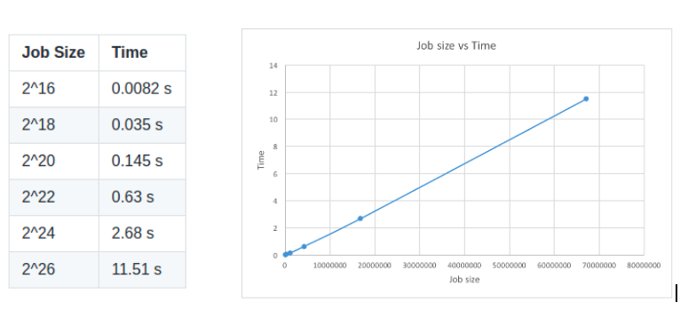
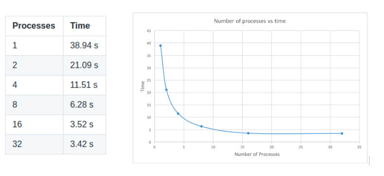
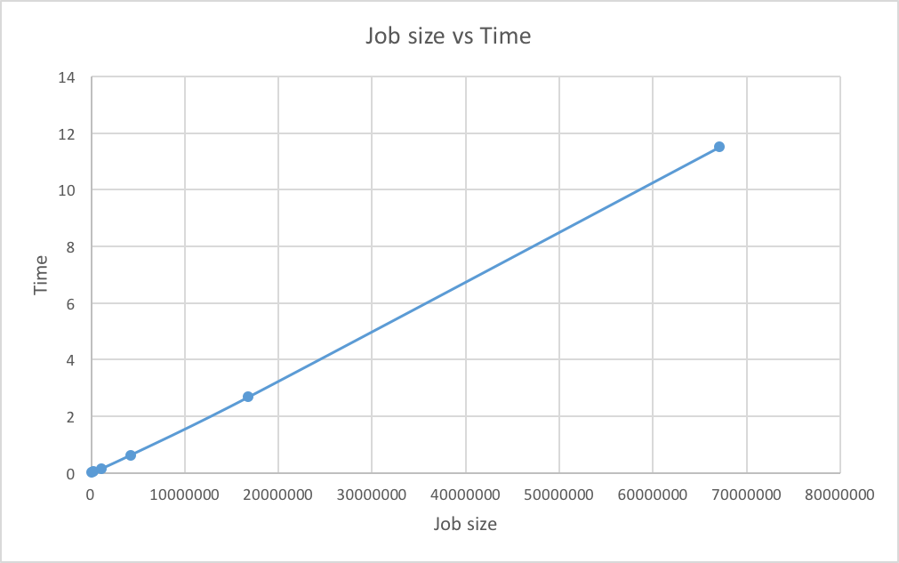
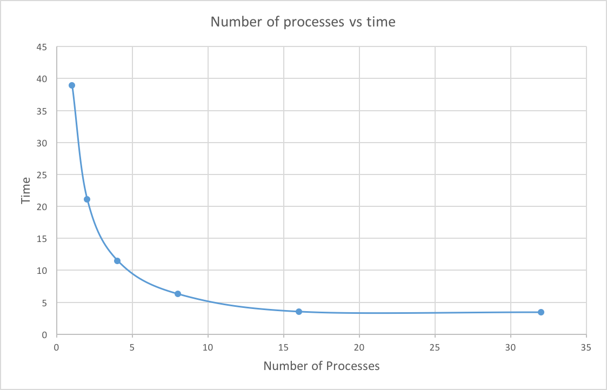

## Lab 3 - Parallel Hypersort using MPI

This assignment involves implementation of a parallel version of the well know Quicksort algorithm using MPI. Statement for the same is linked [here](./Statement.pdf).


#### Running the code

1. To compile -

    ```bash
    ./scripts/compile.sh
    ```

2. To run - 

    - To generate an input file, given n (for a population of 2^n) - 
        ```bash
        ./generate <n>
        ```
    
    - To perform hypersort -
        ```bash
        ./scripts/run.sh <input-file> <output-file> --numProcess  <number of processes>
        ```
    

#### Code Description


1. **Parallelisation  Strategy :**

    - Initially, the given file is just read by the process 0 and the relevant array fractions are then sent to different processes, after which each process has its own local vector. This distributes the given array equally (almost, when not a power of 2, last process gets the extra elements) amongst the various processes
    - In the middle of the algorithm, the size of vectors may change when half the arrays are received and sent to the other processes
    - This implementation might perform poorly in cases where after a split, few of the vectors might have large number of elements


2. **Design Decisions :** 

    - Vectors have been used instead of int[] as the size of the vector can be easily changed and helps easy merging of the two vectors at every iteration in every process
    - For convenience, we have declared vectors only once per process and we clear it in every iteration so that system calls are minimised
    - As much as possibile, minimal copies of the data are created to improve memory performance

3. **Load Balancing Strategy :** 

    - We distribute the original array equally amongst the various threads. The last process may have slightly more data depending on divisibility of input size
    - Splitting the vector about the median of the process 0 subarray, after sorting, maximises the log likelihood that the split in the array will almost equal amongst all the processes
    - However, due to its probabilistic nature, the algorithm is likely to perform poorly in cases like after a split, few of the subarrays may have huge number of elements and some others may have less

4. **Results :**

    Job Size vs Time

    

    Number of processes vs Time

    


<!-- 

| Job Size | Time     |
| -------- | -------- |
| 2^16     | 0.0082 s |
| 2^18     | 0.035 s  |
| 2^20     | 0.145 s  |
| 2^22     | 0.63 s   |
| 2^24     | 2.68 s   |
| 2^26     | 11.51 s  |




| Processes | Time    |
| --------- | ------- |
| 1         | 38.94 s |
| 2         | 21.09 s |
| 4         | 11.51 s |
| 8         | 6.28 s  |
| 16        | 3.52 s  |
| 32        | 3.42 s  |



 -->